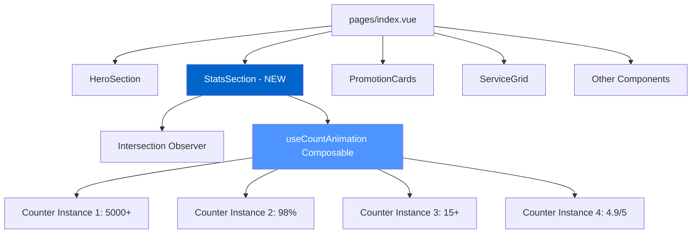
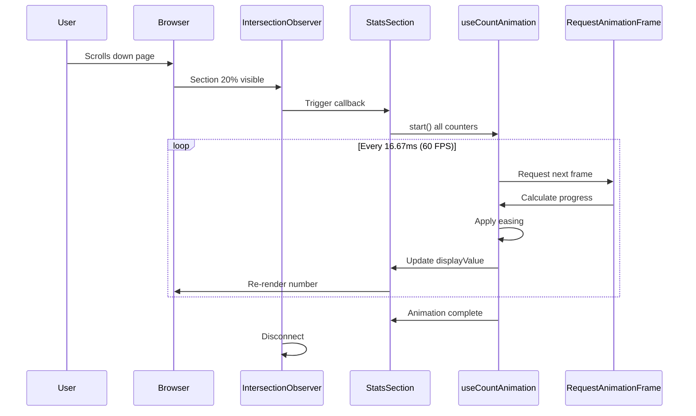

# Animated Stats Section - Implementation Plan

## Executive Summary

This plan outlines the implementation of an animated statistics section for the Beauty Med Spa homepage. The section will display 4 key metrics (5000+ customers, 98% satisfaction, 15+ years experience, 4.9/5 rating) with smooth counting animations that trigger when users scroll to the section.

## Architecture Overview

### Component Hierarchy



### Data Flow



## Implementation Steps

### Step 1: Create Composable Directory Structure

```bash
composables/
  useCountAnimation.ts  # New file
```

### Step 2: Implement useCountAnimation Composable

**File**: `composables/useCountAnimation.ts`

**Key Features**:
- Smooth easing with `easeOutQuart` function
- RequestAnimationFrame for 60 FPS
- Customizable duration and formatters
- Automatic cleanup

**Pseudo-code Logic**:
```typescript
1. Accept target value and options
2. Create reactive ref for current display value
3. On start():
   a. Record start time
   b. Use requestAnimationFrame loop
   c. Calculate progress (0 to 1)
   d. Apply easing function
   e. Update current value
   f. Format value with custom formatter
   g. Continue until duration complete
4. Cleanup on component unmount
```

### Step 3: Create StatsSection Component

**File**: `components/home/StatsSection.vue`

**Component Structure**:
```vue
<template>
  <section ref="statsRef" class="stats-section">
    <div class="container">
      <div class="stats-grid">
        <StatCard 
          v-for="(stat, index) in stats"
          :value="displayValues[stat.id]"
          :label="stat.label"
          :delay="index * 100"
        />
      </div>
    </div>
  </section>
</template>

<script setup>
  // 1. Setup refs
  // 2. Define stats configuration
  // 3. Create counter instances
  // 4. Setup Intersection Observer
  // 5. Trigger animations on visibility
  // 6. Cleanup
</script>
```

**Stats Configuration**:
```typescript
const stats = [
  {
    id: 'customers',
    target: 5000,
    label: 'Khách Hàng',
    format: (n) => `${Math.round(n)}+`
  },
  {
    id: 'satisfaction',
    target: 98,
    label: 'Hài Lòng',
    format: (n) => `${Math.round(n)}%`
  },
  {
    id: 'experience',
    target: 15,
    label: 'Năm Kinh Nghiệm',
    format: (n) => `${Math.round(n)}+`
  },
  {
    id: 'rating',
    target: 4.9,
    label: 'Đánh Giá',
    format: (n) => `${n.toFixed(1)}/5`
  }
]
```

### Step 4: Intersection Observer Implementation

**Observer Configuration**:
```typescript
const observer = new IntersectionObserver(
  (entries) => {
    entries.forEach(entry => {
      if (entry.isIntersecting) {
        // Trigger all animations
        startAllAnimations()
        // Disconnect to prevent re-triggering
        observer.disconnect()
      }
    })
  },
  {
    threshold: 0.2,  // Trigger at 20% visibility
    rootMargin: '0px'
  }
)
```

### Step 5: Animation Timing

**Duration**: 2000ms (2 seconds)

**Easing Function**: easeOutQuart
```
f(x) = 1 - (1 - x)^4

Graph:
1.0 |         ___----
    |    __---
0.5 | _--
    |/
0.0 +---------------
    0    0.5    1.0
```

This creates a fast start with smooth deceleration, making the animation feel snappy yet natural.

### Step 6: Visual Design

**Layout Grid**:
- Mobile: 2 columns (grid-cols-2)
- Desktop: 4 columns (lg:grid-cols-4)
- Gap: 1.5rem (gap-6)

**Typography**:
- Numbers: 2.25rem (text-4xl), bold, #0066cc
- Labels: 1rem (text-base), regular, #757575

**Colors**:
- Background: #f5f5f5 (bg-gray-50)
- Text (numbers): #0066cc (text-primary)
- Text (labels): #757575 (text-gray-600)

**Spacing**:
- Section padding: 4rem vertical (py-16)
- Number-label gap: 0.5rem (mb-2)

### Step 7: Animation Enhancements

**Fade-in + Slide-up**:
```css
Initial state:
  opacity: 0
  transform: translateY(2rem)

Final state:
  opacity: 1
  transform: translateY(0)

Transition: 1000ms ease-out
```

**Staggered Delays**:
- Card 1: 0ms
- Card 2: 100ms
- Card 3: 200ms  
- Card 4: 300ms

This creates a cascading effect for visual appeal.

### Step 8: Accessibility Features

**Reduced Motion Support**:
```css
@media (prefers-reduced-motion: reduce) {
  .stats-section {
    /* Skip animation, show final values */
    .stat-card {
      opacity: 1 !important;
      transform: none !important;
      transition: none !important;
    }
  }
}
```

**Semantic HTML**:
- Use `<section>` for stats container
- Use proper heading hierarchy
- Ensure color contrast ratios meet WCAG AA standards

### Step 9: Integration into Homepage

**Before**:
```vue
<template>
  <div>
    <HeroSection />
    <PromotionCards />
    <!-- ... -->
  </div>
</template>
```

**After**:
```vue
<template>
  <div>
    <HeroSection />
    <StatsSection />  <!-- NEW -->
    <PromotionCards />
    <!-- ... -->
  </div>
</template>
```

## Performance Optimization

### Best Practices Applied

1. **Single Observer**: One Intersection Observer for entire section (not per stat)
2. **RAF Cleanup**: Cancel pending animation frames on unmount
3. **One-time Trigger**: Disconnect observer after first animation
4. **Reactive Efficiency**: Only update refs, no direct DOM manipulation
5. **CSS Animations**: Use CSS transitions for fade/slide effects

### Expected Performance

- **Animation FPS**: 60 FPS (16.67ms per frame)
- **Memory Impact**: Minimal (~4 reactive refs)
- **CPU Usage**: Low (RAF is browser-optimized)
- **Paint Operations**: Minimal (text content updates only)

## Testing Strategy

### Manual Testing Checklist

1. **Animation Behavior**
   - [ ] Numbers start at 0
   - [ ] Numbers count up to target values
   - [ ] Animation duration is ~2 seconds
   - [ ] Animation triggers on scroll (not page load)
   - [ ] Animation only plays once per visit

2. **Number Formatting**
   - [ ] 5000+ displays correctly
   - [ ] 98% displays correctly
   - [ ] 15+ displays correctly
   - [ ] 4.9/5 displays correctly with 1 decimal

3. **Responsive Design**
   - [ ] 2-column layout on mobile
   - [ ] 4-column layout on desktop
   - [ ] Proper spacing at all breakpoints

4. **Visual Effects**
   - [ ] Fade-in animation works
   - [ ] Slide-up animation works
   - [ ] Staggered delays visible

5. **Accessibility**
   - [ ] Reduced motion preference respected
   - [ ] Screen reader announces final values
   - [ ] Keyboard navigation works

6. **Performance**
   - [ ] No janky animation
   - [ ] No memory leaks
   - [ ] No console errors

### Browser Testing

- Chrome 90+
- Firefox 88+
- Safari 14+
- Edge 90+
- Mobile browsers (iOS Safari, Chrome Mobile)

## File Changes Summary

### New Files
```
composables/useCountAnimation.ts     (~80 lines)
components/home/StatsSection.vue     (~120 lines)
STATS_ANIMATION_SPEC.md              (specification doc)
IMPLEMENTATION_PLAN.md               (this document)
```

### Modified Files
```
pages/index.vue                      (+1 line: <StatsSection />)
```

### Total Lines of Code
~200 lines of new code

## Code Review Checklist

Before marking complete, verify:

- [ ] TypeScript types are properly defined
- [ ] No ESLint errors
- [ ] No console.log statements left in code
- [ ] Comments explain complex logic
- [ ] Code follows project conventions
- [ ] Responsive design tested on multiple devices
- [ ] Animation performance is smooth
- [ ] Accessibility features implemented
- [ ] Browser compatibility verified

## Deployment Notes

### Pre-deployment
1. Test on staging environment
2. Verify animation on slow networks
3. Test with screen readers
4. Validate on mobile devices

### Post-deployment
1. Monitor performance metrics
2. Check for console errors in production
3. Gather user feedback on animation feel
4. A/B test animation duration if needed

## Future Enhancements (Optional)

1. **Configurable Stats**: Move stats data to CMS or config file
2. **Animation Variants**: Add option for different easing functions
3. **Sound Effects**: Optional sound on count completion
4. **Particle Effects**: Add sparkle/confetti on animation end
5. **A/B Testing**: Test different animation durations (1.5s vs 2s vs 2.5s)

## Success Criteria

The implementation is successful when:

1. ✅ Numbers animate smoothly from 0 to target
2. ✅ Animation triggers on scroll (Intersection Observer)
3. ✅ All 4 stats display with correct formatting
4. ✅ Responsive design works on all devices
5. ✅ Animation feels natural and professional
6. ✅ No performance issues or errors
7. ✅ Accessibility requirements met
8. ✅ Code is clean, typed, and well-documented

## Timeline

| Task | Estimated Time | Priority |
|------|---------------|----------|
| Create composable | 30 min | High |
| Create component | 45 min | High |
| Add animations | 20 min | Medium |
| Test & refine | 30 min | High |
| Documentation | 15 min | Low |
| **Total** | **~2.5 hours** | |

## Next Steps

Once this plan is approved:

1. Switch to **Code mode** to implement the solution
2. Create `useCountAnimation.ts` composable
3. Create `StatsSection.vue` component
4. Integrate into homepage
5. Test and refine
6. Deploy to production

---

**Ready to proceed?** Switch to Code mode to begin implementation.